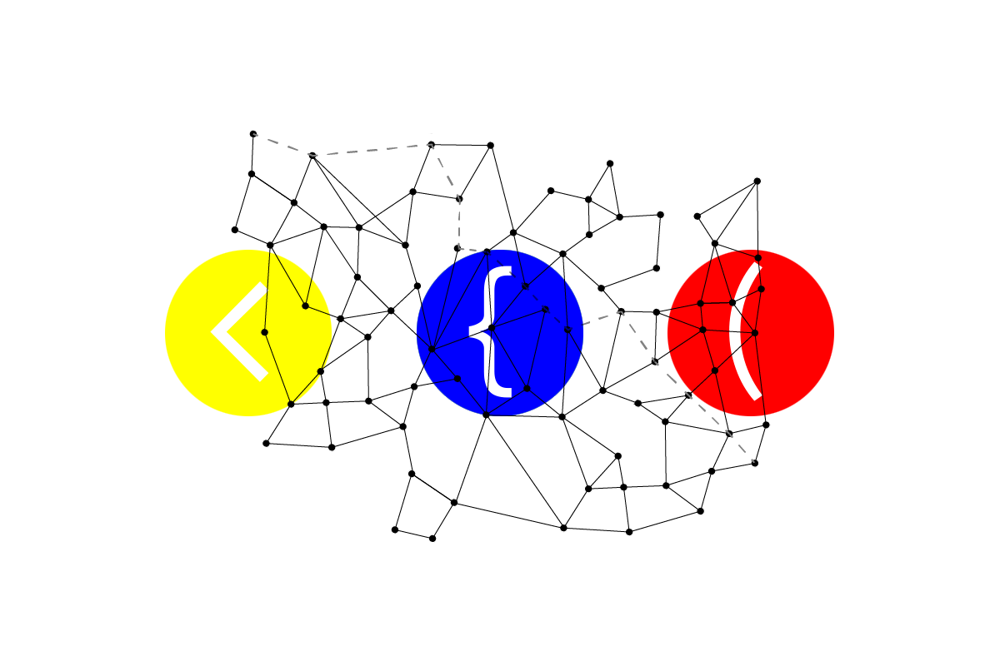

Intro to webdesign
==================
in-class demo download for education
------------------------------------

# Top-level Heading
## subheading 
### subheading of a subheading 
Underlined top-level heading
============================

underlined subheading
---------------------

This is a demostration for educational purposes

[New york University] (https://www.nyu.edu/)

As Eckhar Tolle writes: 

> Wherever you are, be there totally.

*This text will be italicized.*

**This text will be bold.**

**You are _all_ welcome here**

This is an unordered list. 

- Item
- Item
- Item

Markdown reference for [Intro to Webdesign] (https://cs.nyu.edu/courses/fall23/CSCI-UA.0004-004/assignments/unix/) :books: :computer: :surfer: